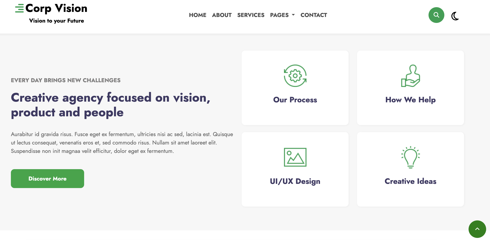
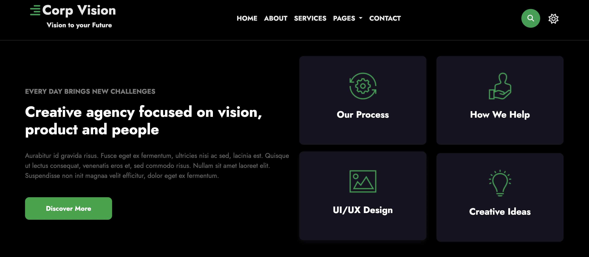
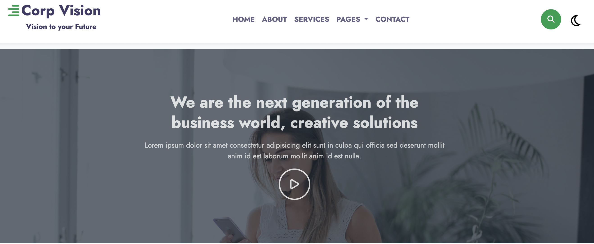

#CORPVISION - BOOTSTRAP CAPSTONE PROJECT
---

##Introduction

This is the README file for the Corpvision -Bootstrap Capstone Project.
The aim of this repository is to advancing responsive sites with bootstrap version 5.2 into Castone exercise, which serves as a culminating academic and intellectual experience for our team project.
####By skimming our site main featute, please view through link below:

**Youtube Channel:** https://youtu.be/ToD6wJ-MgmI
**Deploy:** https://corpvison-bootstrap.vercel.app/

##Contributing activities
Our team include 2 persons with contributions and project schedule below:
https://docs.google.com/spreadsheets/d/19ElFrsqMdHO-maP6fyL8Z3sJ06ZFFMy_DYchkLrKOXw/edit?usp=sharing


Website include 5 main pages:
1. Home 
2. About
3. Services
4. Pages (Blog posts and 404 page )
5. Contact 

##Features
CorpVision is built with a responsive design support by Bootstrap, ensuring that website looks great on all devices, including desktops, tablets, and mobile phones. Content will be accessible and visually appealing to users regardless of the device they use to access your site.

###Higlight features:
####1. Fixed header on page
Fixed header and nagivigation bar remain at the top of the page as a user scrolls up and down. 


####2. Pop up search (HTML and Javascript)
```c
<div class="header-search HeaderSearch">
                <div class='control mr-3'>
                <div class='btn-material'>
                  <i class='fa fa-search icon-material-search'></i>
                </div>
                </div>
                <!-- full screen form controls -->
                <i class='icon-close fa fa-close material-icons'></i>
                <form action="https://wp.w3layouts.com/corpvision/" method="GET" class='search-input'>
                <input class='input-search' placeholder='Start Typing' type='text'>
                </form>
              </div>
```

```c
 <!-- Search -->
  <script src="https://cdnjs.cloudflare.com/ajax/libs/jquery/3.7.0/jquery.min.js" integrity="sha512-3gJwYpMe3QewGELv8k/BX9vcqhryRdzRMxVfq6ngyWXwo03GFEzjsUm8Q7RZcHPHksttq7/GFoxjCVUjkjvPdw==" crossorigin="anonymous" referrerpolicy="no-referrer">
  </script>
      <script>
        $('.control').click(function () {
          $('body').addClass('search-active');
          $('.input-search').focus();
        });
      
        $('.icon-close').click(function () {
          $('body').removeClass('search-active');
        });
      </script>
```


####3. Dark and light theme
Switch between dark and light mode with CSS and JavaScript.


```c
 <script>
   document.getElementById("checkbox").onclick = function () {
   document.getElementById("myBody").classList.toggle("dark");
   };  
  </script>
```





####3. Video Pop Up by using Magnific Library

**Magnific Library** https://dimsemenov.com/plugins/magnific-popup/documentation.html


```c

<!-- Magnific Popup core CSS file -->
Magnific Popup is a touch-friendly popup just for video by adding ifram video link and then CSS select pop up item.

<link rel="stylesheet" href="magnific-popup/magnific-popup.css">

  <script src="https://cdnjs.cloudflare.com/ajax/libs/magnific-popup.js/1.1.0/jquery.magnific-popup.js" integrity="sha512-C1zvdb9R55RAkl6xCLTPt+Wmcz6s+ccOvcr6G57lbm8M2fbgn2SUjUJbQ13fEyjuLViwe97uJvwa1EUf4F1Akw==" crossorigin="anonymous" referrerpolicy="no-referrer"></script>
  
  <script>
    $(document).ready(function () {
    $(".popup-with-zoom-anim").magnificPopup({
      type: "inline",
  
      fixedContentPos: false,
      fixedBgPos: true,
  
      overflowY: "auto",
  
      closeBtnInside: true,
      preloader: false,
  
      midClick: true,
      removalDelay: 300,
      mainClass: "my-mfp-zoom-in"
    });
  });
  ```




---
Support and Contact
For any questions, support, or feedback, please visit our support page for more information.
